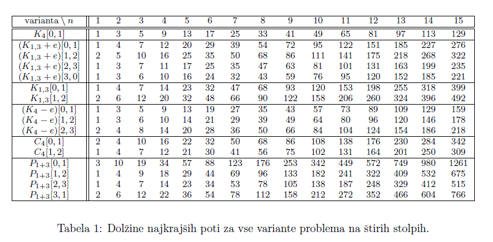

# TowerOfHanoi

Problem hanojskih stolpov(https://en.wikipedia.org/wiki/Tower_of_Hanoi). 
Program rešuje problem - išče najmanjše število korakov, kjer imamo na voljo 4 stolpe in max. 15 diskov. 

[0,1] - Vsi diski so na začetku na stolpu 0, prestaviti pa jih želimo na stolp 1.

Medsebojno povezanost stolpov določa graf danega problema:

